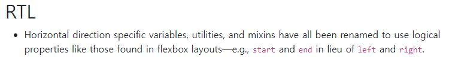

# Bootstrap 5.X 수평 방향 명칭 변화

Bootstrap 5.3을 사용해서 웹 프론트엔드 개발을 하던 와중에 margin을 넣을 필요가 있어서 예전 spacing 자료에서 보았던 **ml**, **mr**코드를 통해 공간을 마련하려했다. 그런데 mr, ml에 웹페이지가 아무 반응이 없고 mx, my는 정상적으로 작동하였다.

이에 관해서 구글링을 해보니 5.0 이상 버전부터 더 이상 수평 방향에 대한 left와 right라는 코드를 사용하지 않는다고 하며, Bootstrap 홈페이지의 5.0버전 migration 문서에서 다음과 같이 명시하고 있다.

즉, flexbox 레이아웃에서의 개념에 맞추기 위해서 수평방향에 대한 명칭을 left, right 대신에 **start**, **end**로 변경하는 것이다. 이를 확인하고 mr, ml대신에 **ms**,**me**를 사용하니 정상적으로 동작하였다. 

~4.X 버전의 Bootstrap을 사용하는 일이 많으면 상관이 없겠지만 5.0 이상을 사용하게 된다면 혼란이 없도록 명칭이 변경된 것을 인지하고 있어야겠다.
