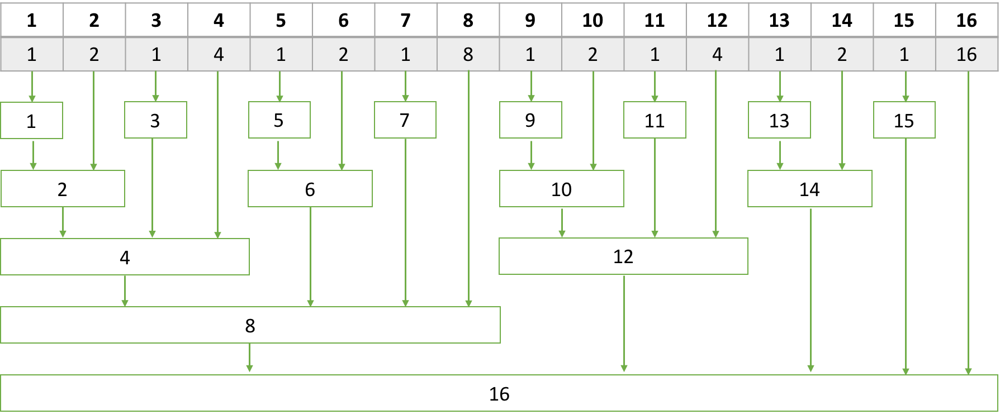

# 펜윅트리 (Fenwick Tree)
## 펜윅트리란?
- 세그먼트 트리(Segment Tree)와 같이 구간에 대한 합을 빠르게 구하기 위해 사용되는 자료구조
- 세그먼트 트리는 정적인 데이터에 대해서만 적용할 수 있지만, 펜윅트리는 동적인 데이터에도 적용할 수 있다.



(출처: [acmicpc.net](https://www.acmicpc.net/blog/view/21))

- N개의 데이터가 주어지면, N개의 노드 및 각 Index들의 최하위 비트를 사용하여 구간 합(또는 누적합)을 정리한다.

## 펜윅트리 생성
- 비트 연산을 위하여 제일 첫 데이터의 Index를 1로 정의한다.
- 각 index를 비트로 표현하고, 해당 비트에서 1인 가장 작은 자리 x를 구한다.
  - 1(2) -> 1, 10(2) -> 10, 110(2) - > 10
- 해당 index부터 x칸 앞의 node에 추가하고, x를 갱신하면서 반복한다.

## 데이터 갱신
- 이전 데이터에서의 변화량만큼, 생성과 마찬가지의 방법으로 각 node에 변화량을 더해준다.

## 구간합
- 현재의 index에서 1인 최하위 비트만큼 빼면서 거치는 node를 모두 구하면 1~index의 구간 합을 구할 수 있다.
- 1~i까지의 합을 sum(i)라고 하면, x~y 구간의 합은 sum(y) - sum(x-1)이다.

## 구현

```cpp
#include <iostream>
#include <vector>

using namespace std;

// 원본 데이터
int num[4] = {6, 20, 13, 4};
int n = 4;

vector<int> tree;

void Update(int index, int value){
    
    while(index <= n){
        tree[index] += value;
        index += (index & -index);
    }
    
    return;
}

int sum(int index){
    
    int ret = 0;
    
    while(index > 0){
        ret += tree[index];
        index -= (index & -index);
    }
    
    return ret;
}

int main(){
    
    tree.resize(n + 1);
    tree[0] = 0;
    
    for(int i = 0; i < n; i++){
        Update(i + 1, num[i]);
    }
    
    // 2~3 합 //33
    cout<<sum(3) - sum(2 - 1)<<"\n";
    // 1~4 합 //43
    cout<<sum(4) - sum(1 - 1)<<"\n";
    
    // 20 -> 8
    Update(2, 8 - 20);
    
    // 2~4 합 //25
    cout<<sum(4) - sum(2 - 1)<<"\n";
    // 1~3 합 //27
    cout<<sum(3) - sum(1 - 1)<<"\n";
    
    return 0;
}

```