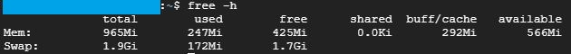

# SWAP 메모리 할당하기 - 클라우드 서비스의 인스턴스 프리즈 해결

서비스를 개발하고 배포를 하는 경우 클라우드 서비스를 이용하는 경우가 매우 많아졌다. 그 중에서 필자와 같이 ~~(가난한)~~ 지출을 최대한 적게 하기 위해 체험을 위한 크레딧을 제외하고도 계속 무료로 배포하기 위해서, 무료로 사용할 수 있는 프리티어(Free tier) 인스턴스를 확인해서 사용하는 경우도 꽤 많다. 하지만 대부분의 클라우드 서비스에서 무료로 제공하는 컴퓨팅 서비스는 그 성능이 엄청 제한적이며, 프로젝트를 빌드하거나 도커를 올리는 등의 행동만 해도 컴퓨터 리소스를 상당 부분 차지하기 때문에 프리즈되는 경우가 종종 발생한다.

이는 대부분 VM 인스턴스의 메모리 리소스(RAM)가 부족해서 발생하고, 해결을 위해서는 보조기억장치를 RAM처럼 활용하도록 하는 **SWAP 스왑 메모리**를 설정해줘서 리소스를 확보해 줄 필요가 있다.

## 1. 빈 파일 생성

```bash
dd if=/dev/zero of=/swapfile bs=1M count=2048 conv=excl
```

dd 명령어에서 사용되는 **/dev/zero**는 요청한 크기 만큼의 널(NULL) 문자를 제공하는 유닉스 계열 OS의 특수 파일이다. 지금은 블록 사이즈를 1M로 하고 2048개 만큼, 즉 대략 2GB만큼의 공간을 확보해서 스왑 파일을 만든다.

## 2. SWAP 파일 등록

```bash
chmod 600 /swapfile

mkswap /swapfile

swapon /swapfile
```

 생성한 SWAP을 사용할 수 있도록 해당 파일의 권한을 0644 또는 0600으로 변경해준다. 그리고 **mkswap /swapfile**로 해당 파일을 스왑 공간으로 사용할 것을 설정하고, **swapon /swapfile**로 스왑 공간 사용을 시작한다.

## 3. SWAP 메모리 적용 확인

```bash
free -h
```



스왑 메모리 활성화가 완료되면 **free -h**를 통해 제대로 활성화 되었는지를 확인한다. 제대로 활성화 되었다면 Swap 영역에 대략 2GB만큼의 공간이 할당되어 사용되는 것을 확인할 수 있다.

## 4. 재부팅시 자동 사용 설정

스왑 메모리 설정은 영구적인 것이 아니라 인스턴스 재시작 또는 재부팅을 하게 되면 해당 설정이 풀리게 된다. 따라서 인스턴스가 실행되면 자동으로 스왑 설정이 되도록 **/etc/fstab** 파일을 수정할 필요가 있다.

```bash
/swapfile swap swap auto 0 0
```

(혹시 모를 상황을 대비해서 원래 있던 **/etc/fstab** 파일은 백업을 해두는 것이 좋다.)


**/etc/fstab/**에 위의 라인을 추가하게 되면 인스턴스을 재시작하더라도 자동적으로 스왑 메모리를 활성화한다.