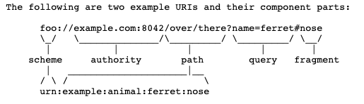
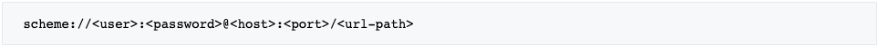
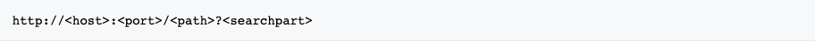
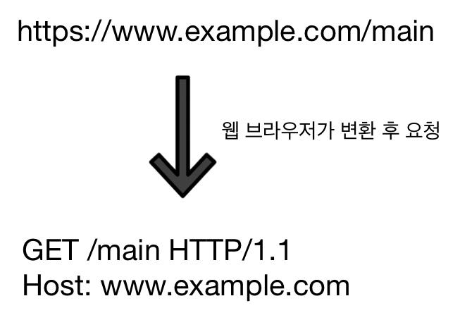
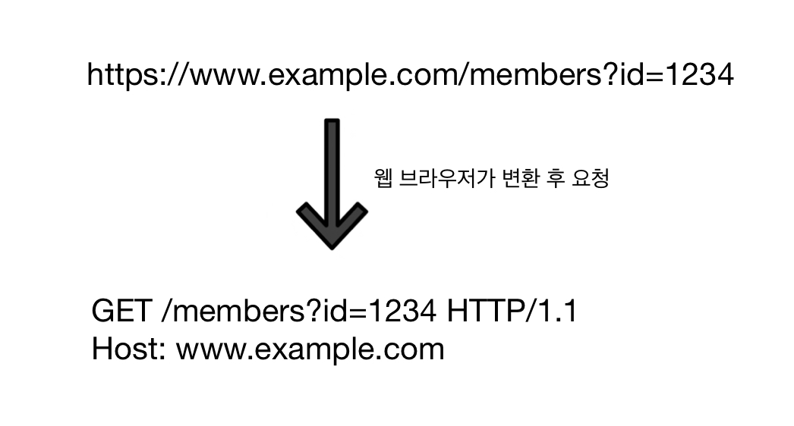
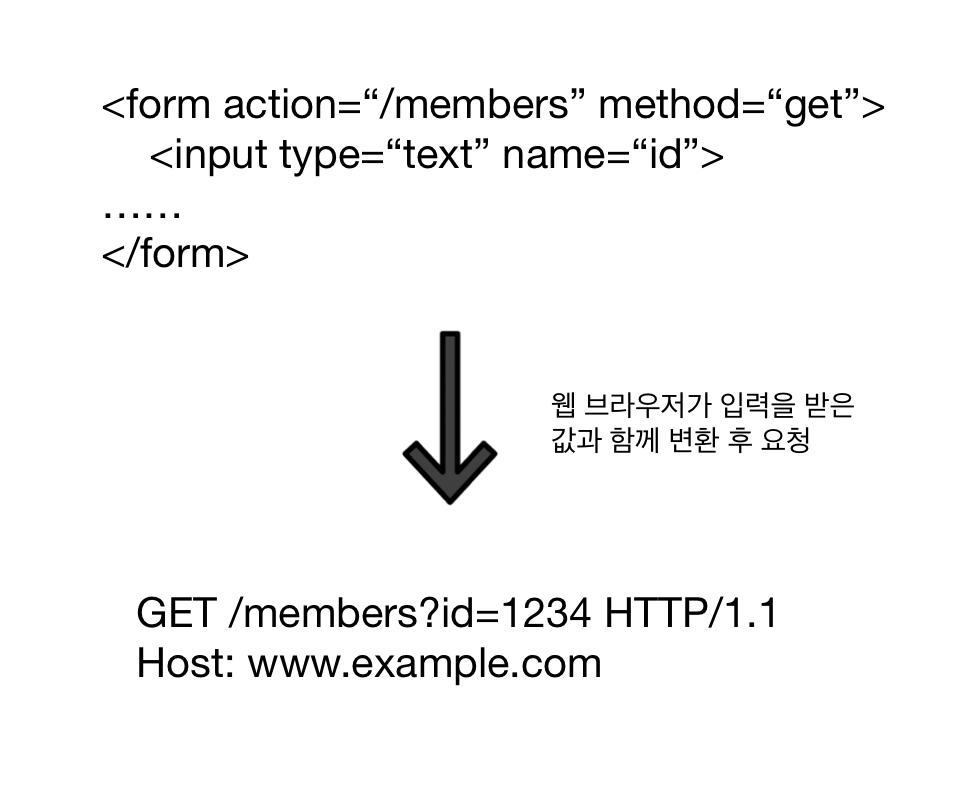
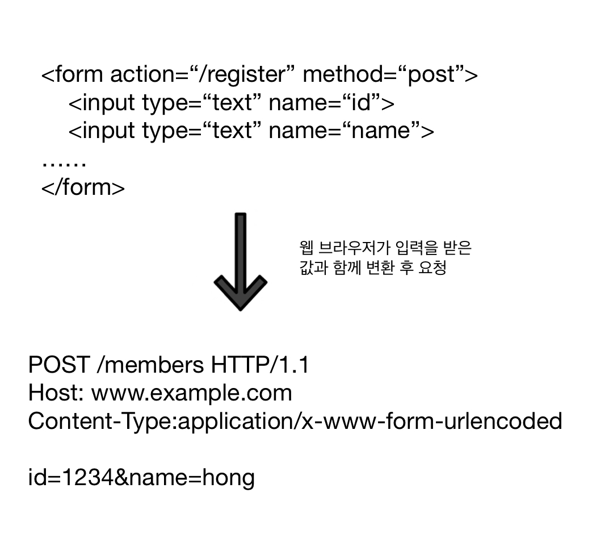
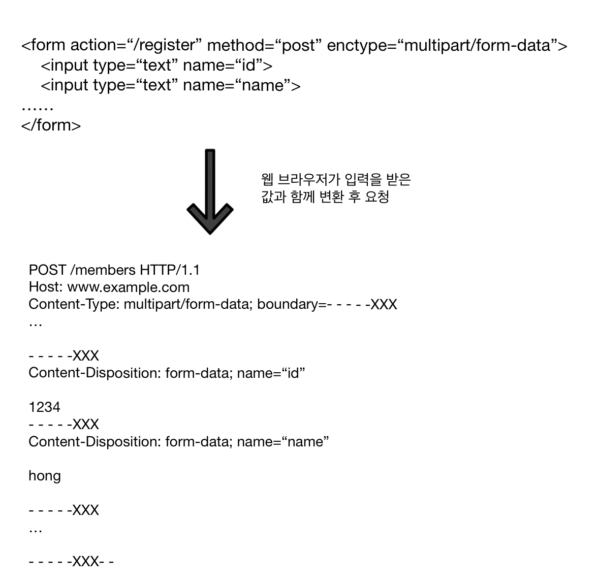
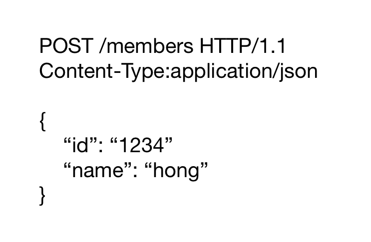

# 모든 개발자를 위한 HTTP 웹 기본 지식

> ### HTTP 웹의 기본적인 내용을 정리하였습니다. 
>
> 해당 문서는 김영한님의 [모든 개발자를 위한 HTTP 웹 기본 지식](https://inf.run/HKd6)을 수강하면서 작성되었으며, [자주하는 질문](https://docs.google.com/document/d/1j0jcJ9EoXMGzwAA2H0b9TOvRtpwlxI5Dtn3sRtuXQas/edit?usp=sharing)에 기술되어 있는 규칙에 따라 학습 후의 내용을 필자의 생각으로 정리하여 수록됩니다. 또한 해당 강의는 유료 강의이며 강의 제공 측의 금지 사항으로 전체 소스 코드는 제공되지 않습니다.
>
> 이하의 내용들은 좀 더 간결하고 효율적으로 정리하기 위해 높임말 없이 작성되었습니다.

## 목차

1. [URI와 웹 브라우저](#1-uri와-웹-브라우저)
2. [HTTP란?](#2-http란)
3. [HTTP 메서드](#3-HTTP-메서드)
4. [HTTP 메서드 활용](#4-HTTP-메서드-활용)
5. [HTTP 상태 코드](#5-HTTP-상태-코드)
6. [HTTP 헤더](#6-HTTP-헤더)

----------

## 1. URI와 웹 브라우저

#### URI: Uniform Resource Identifier

 리소스를 식별하기 위해 사용되는 통일된 방식을 의미하며, 리소스는 URI를 통해 식별될 수 있는 모든 것을 의미한다. 현재 보편적으로 사용되는 하위 개념으로는 URL과 URN 등이 있다.

*출처: [RFC3986](https://www.rfc-editor.org/rfc/rfc3986#section-3)*

#### URL : Uniform Resource Locator

 리소스의 위치를 지정하는 규약이며, 흔히 말하는 웹 페이지의 주소 뿐만 아니라 컴퓨터 네트워크상의 모든 자원을 나타낼 수 있다.

*출처: [위키피디아 URL](https://ko.wikipedia.org/wiki/URL)*

###### Components

- Scheme: 주로 프로토콜을 사용한다. (e.g. http, https ftp 등)
- Userinfo: URL에 사용자정보를 포함해서 인증할 때 사용하지만 거의 사용하지 않는다.
- Host: 호스트명을 사용하며 도메인명이나 IP주소를 직접 사용할 수 있다.
- Port: 접속에 사용할 포트 번호이며, 프로토콜에 맞춰서 생략하는 경우가 많다.
- Path: 리소스의 경로를 사용하며, 계층적인 구조로 표현한다.
- Query: "Key" = "Value" 형태이며, '?'로 시작하고 '&'로 나열한다. Query parameter, Query string등으로 부른다.
- Fragment: 서버에 전송하지 않는 html 내부 북마크 등에 사용되는 정보이며, '#'로 시작한다.

#### URN: Uniform Resource Name

 리소스에 이름을 부여하는 규약이며, 위치와 달리 영속적인 특성을 가진다. URN 이름만으로 실제 리소스를 찾을 수 있는 방법이 보편화 되지 않았기 때문에 상대적으로 사용되는 빈도 수는 적다.

*출처: [위키피디아 URN](https://ko.wikipedia.org/wiki/URN)*

#### 웹 브라우저 요청 흐름

1. 클라이언트의 웹 브라우저가 HTTP 메시지를 생성한다.
2. 웹 브라우저의 Socket 라이브러리를 사용해서 도착지점과 TCP/IP 연결을 하고 OS에 데이터를 넘긴다.
   - IP와 Port 번호를 기본적으로 사용해서 도착지점을 파악하며, IP가 없고 도메인 이름이 있다면 DNS 조회로 IP를 알아내고, Port 번호가 없으면 프로토콜을 통해 포트를 유추한다.
3. HTTP를 포함한 TCP/IP 패킷을 생성하고 서버로 전송한다.
4. 서버는 패킷을 수신하고 이에 맞는 응답 메시지를 클라이언트에 전송한다.
5. 전송 받은 응답 메시지를 사용해서 웹 브라우저가 HTML 렌더링을 수행해서 화면에 보여준다.

----------

## 2. HTTP란?

#### HTTP: HyperText Transfer Protocol

 HTTP 초기에는 HTML 메시지와 Text 전송을 기반으로 제작되었으며, 현재는 이미지, 음성, 영상, 파일 등의 거의 모든 형태의 데이터를 전송하는 것이 가능해졌다. 서버간의 데이터 송수신에서도 대부분 HTTP를 사용한다.

HTTP/1.1에서 현재의 기능을 거의 대부분 갖춰서 이를 주로 사용하고 있으며, HTTP/2와 HTTP/3의 사용 비율도 점차 증가하고 있다.

#### HTTP 특징

1. 클라이언트 - 서버의 구조에서 사용한다.
2. 무상태 프로토콜 (Stateless), 비연결성 (Connectionless)을 갖추었다.
3. HTTP 메시지를 통해 통신한다.
4. 단순하며 확장이 가능하다.

#### 무상태 프로토콜 (Stateless)

- 서버가 클라이언트의 상태를 보존하지 않는다.
- 장점: 서버를 확장할 때 용이하다.
- 단점: 클라이언트가 전송시 마다 추가 데이터를 전송할 필요가 있다.

#### Stateful, Stateless

- Stateful: 요청을 수행하는 서버가 각 클라이언트의 상태 정보를 저장하고 있는 방식이다.
  * 요청을 수행하는 도중에 처리하는 서버가 바뀌어선 안된다.
  * 장애 발생시에 처음부터 통신을 시작하거나, 상태정보를 다른 서버에 전송하는 등이 방식이 필요하다. 
- Stateless: 요청을 수행하는 서버가 클라이언트 정보를 저장하지 않는 방식이다.
  - 각 메시지 전송에 클라이언트의 상태를 실어서 전송한다.
  - 요청을 수행하는 도중에 처리하는 서버가 바뀌더라도 괜찮다.
  - 트래픽이 증가했을 때 서버 증설이 용이하다.

#### Stateless의 한계

 무상태로 설계하는 것에는 한계가 존재한다. 예를 들어 로그인 기능의 경우, 로그인한 사용자의 로그인 여부를 서버가 가지고 있을 필요가 있다. 일반적으로 이것은 브라우저 쿠키와 서버 세션을 함께 활용하는 등의 방법을 통해 구현한다. 꼭 상태 유지를 해야한다면 최소한의 상태만 유지할 수 있도록 한다.

#### 비 연결성 (Connectionless)

- 연결을 유지하는 모델: 한 번 이어진 연결을 계속해서 유지하며 이후 빠른 통신이 가능하지만 서버 자원을 소모한다.
- 연결을 유지하지 않는 모델: 요청 처리가 완료되면 해당 연결을 끊고 다른 요청시에 다시 연결하여 최소한의 자원을 유지한다.

HTTP는 기본적으로 Connectionless이며, 보통 매우 많은 사용자가 서비스에 요청해서 처리하는 양은 매우 작다고 할 수 있으므로 비 연결성을 갖추면 서버 자원을 효율적으로 사용할 수 있다.

HTTP 초기에는 각 요청 및 응답 마다 연결 만들고 끊어주는 것을 반복했지만 매우 비효율적이었고, 현재는 어느정도의 연결 유지를 통해 효율적으로 요청 처리를 수행할 수 있게 되었다.

최대한 무상태로 설계해야 특정 시간 대에 사용자가 몰리는 서비스를 서버 추가 등을 통해 간단하게 처리하는 것이 가능해진다.

#### HTTP 메시지

HTTP 메시지는 요청, 응답에 관계없이 다음과 같은 형태를 가진다. 각 라인들은 CRLF(개행문자)로 구분되지만, 보통 편의를 위해 CRLF를 생략하고 다른 줄에 적어서 시각적으로 구분한다.

- Start-line
- Header
- Empty-line
- Message body

`이하 HTTP 메시지 설명에서 각각 SP - 공백, CRLF - 개행, OWS - 띄어쓰기 허용을 의미한다.`

#### Start-line

##### (요청): request-line (응답): status-line

- request-line = **method** SP **request-target** SP **HTTP-version** CRLF
  - method(HTTP 메소드)
    - 서버가 수행할 동작을 지정한다.
    - GET, POST, PUT, DELETE 등이 있다.
  - Request-target(요청 대상)
    - **absolute-path[?query]** - **절대경로[?쿼리]** 형식을 취한다.
- status-line = **HTTP-version** SP **status-code** SP **reason-phrase** CRLF
  - status-code(HTTP 상태 코드)
    - 요청 수행의 성공 여부를 나타내는 코드이다.
    - 200(성공), 400(클라이언트 요청 오류), 500(서버 내부 오류) 등이 있다.
  - reason-phrase(이유 문구)
    - 결과에 대한 설명을 사람이 이해할 수 있는 짧은 문장 또는 단어로 나타냄

#### Header

- Header-field = **field-name**: OWS **field-value** OWS
  - 참고: field-name은 대소문자 구분이 없다.
- HTTP 전송에 필요한 모든 부가정보를 표현한다.

#### Message body

 실제 전송할 데이터로서 HTML 문서, 이미지, 영상, JSON등 byte로 표현할 수 있는 모든 데이터를 담아서 전송할 수 있다.

---

## 3. HTTP 메서드

#### HTTP API URI 설계

URI를 설계할 때는 '회원 **등록**' - '/create-member'처럼 하고자 하는 행위(메서드)에 맞추는 것이 아니라 '**회원** 등록' - ' /members/{id}'처럼 **리소스 식별**을 우선시 하는 것이 중요하다. 리소스 식별을 목적으로 URI를 설계를 하면 행위에 대한 구분이 불가능하다는 의문이 들 수 있다. 이때, URI로는 리소스만을 구분하고, 사용하고자 하는 행위는 HTTP 메서드를 통해서 구분한다.

#### HTTP 메서드

##### 주요 메서드

- GET: 리소스를 조회할 때 사용한다.
- POST: 데이터를 받아서 처리할 때 사용하며, 주로 새로운 리소스 등록에 사용한다.
- PUT: 기존에 존재하는 리소스를 대체하며, 존재하지 않는 리소스라면 새로 등록한다. ***= 덮어씌우기***
- PATCH: 기존 리소스의 특정 부분만 변경한다.
- DELETE: 기존 리소스를 삭제한다.

##### 기타 메서드

- HEAD: 리소스를 조회하는 것에서 GET과 동일하지만, message body를 제외한 state-line과 header만 반환한다.
- OPTIONS: 지정한 리소스에 대해 사용 가능한 메서드를 나열한다. (주로 CORS에서 사용됨)
- CONNECT: 지정한 리소스로 식별할 수 있는 서버에 대해 터널을 설정한다.
- TRACE: 지정한 리소스의 경로를 따라가면서 메시지 루프백 테스트를 수행한다.
- 잘 사용하지 않는 메서드이기 때문에 그냥 알아두는 정도로만 기억하자...

#### GET 메서드

리소스를 조회할 때 사용하며, 같이 보내고 싶은 데이터가 있다면 보통 query를 통해서 전달한다. query 대신 message body에 데이터를 실어보내는 방법도 있지만, 서버에 따라서 해당 기능을 지원하지 않는 경우도 많기 때문에 주로 query로만 데이터를 전달한다.

#### POST 메서드

message body에 특정 데이터를 담은 메시지를 전송해서 해당 데이터의 처리를 요청할 때 사용한다. 전송된 데이터를 처리하는 모든 기능에 대해 사용이 가능하며, 주로 전달된 데이터를 통해서 신규 리소스를 등록하거나 프로세스를 처리하는 작업에 사용한다. 리소스와 리소스 URI에 따른 POST 요청에 대한 처리는 딱히 정해진 것이 없으며, 리소스마다 특정 URI로 요청이 왔을 때의 처리 방법을 결정할 필요가 있다.

*애매해서 어떤 메서드를 사용하는 것이 좋을 지 잘 모르겠다면 그냥 POST를 사용하자*

#### PUT 메서드

데이터를 보냈을 때 특정 리소스가 존재하면 전송된 데이터로 리소스를 대체하고, 없으면 새로운 리소스를 생성할 때 사용한다. POST 메서드와 비슷하지만, 클라이언트가 리소스의 위치를 이미 알고 있고 (또는 위치를 지정하고) 이를 서버에서 존재 유무를 파악한 후 처리를 하는 것이 POST와의 차이점이다.

PUT 메서드는 '덮어씌우기'라고도 표현할 수 있으며, 전송한 데이터와 이미 존재하는 리소스의 필드 정보가 완전히 다르다고 해도 새로운 데이터로 대체하는 작업을 수행한다.

> e.g.) 이미 존재하는 리소스는 'username'과 'age' 필드를 가지고 있고 새로운 데이터는 'age' 필드만 가지고 있다면, 대체되는 리소스는 'age' 필드만을 가지고 있게 된다.

#### PATCH 메서드

리소스를 부분적으로 변경할 때 사용한다. 여러 필드들 중에서 특정 필드의 변경만을 수행한다. 버전 업을 통해 새로 만들어진 메서드이기 때문에 가끔 PATCH를 지원하지 않는 서버가 있다면 대신 POST를 사용하면 된다. 

> e.g.) 이미 존재하는 리소스는 'username'과 'age' 필드를 가지고 있고 새로운 데이터는 'age' 필드만 가지고 있다면, 기존 리소스의 'age' 필드의 값만 새로운 데이터로 변경된다.

#### DELETE 메서드

지정하는 리소스를 삭제할 때 사용한다.

#### HTTP 메서드의 속성

- 안전(Safe): 메서드를 호출했을 때 해당 리소스의 변경이 생기지 않는 것. e.g.) GET, HEAD
- 멱등(Idempotent): 여러 번 호출해도 그 결과는 계속 일치하는 것. e.g.) PUT, DELETE
  - 여러 번 호출해도 괜찮기 때문에 자동 복구 메커니즘 등에 활용할 수 있다.
- 캐시 가능(Cacheable): 응답 결과로 반환된 리소스를 캐시로 저장하고 재사용한 것. e.g.) GET, HEAD
  - POST, PATCH도 캐시를 사용할 수 있지만 message body내의 캐시 키도 고려해서 캐시로 만들어야하기 때문에 구현이 까다로운 관계로 거의 사용하지 않는다.

*속성을 판단할 때 외부 요인(오버플로우로 인한 장애 발생, 다른 메서드 호출 등)으로 인한 리소스 변경은 고려하지 않는다!*

---

### 4. HTTP 메서드 활용

#### Client to Server 데이터 전송

##### 데이터 전달 방법

- Query parameter를 통한 데이터 전달
  - 주로 GET에서 사용하며 검색 결과에 대한 정렬을 위한 필터나 검색어를 전달할 때 사용한다.
- Message body를 통한 데이터 전달
  - 주로 POST, PUT, PATCH에서 사용하며 새로운 리소스를 등록하거나 기존 리소스의 변경을 요청할 때 사용한다.

##### 데이터 전달 상황

- 정적 데이터 조회 (e.g.) 정적 텍스트, 이미지 등)
- 동적 데이터 조회 (e.g.) 검색, 정렬 필터를 통한 목록 조회)
- HTML Form을 통한 데이터 전송 (e.g.) 새로운 리소스 생성 또는 기존 리소스 변경)
- HTML API를 통한 데이터 전송 (e.g.) 새로운 리소스 생성 또는 기존 리소스 변경)
  - Server to Server, 스마트폰 앱 to Server, 웹 클라이언트(Ajax) to Server에서 주로 사용

#### 정적 데이터 조회

정적 데이터는 다른 입력없이 항상 동일하며 조회시에 GET과 리소스 Path만 가지고 조회를 한다. 정적 텍스트와 이미지가 주로 그 대상이다.

#### 동적 데이터 조회

동적 데이터는 검색이나 조회 시에 조건을 제시함으로써 요청의 결과가 변화할 수 있는 것을 의미한다. 조회시에 GET을 사용하며 데이터는 Query parameter에 담아서 전달한다.

#### HTML Form을 통한 데이터 전송

##### Content type이 `x-www-form-urlencoded`일 경우

| Method  |                      GET                      |                     POST                      |
| :-----: | :-------------------------------------------: | :-------------------------------------------: |
| Example |  |  |

HTML Form에서 enctype을 지정하지 않으면 기본적으로 Content-Type이 `x-www-form-urlencoded`으로 지정된다. 전송될 데이터는 Message body에 담아지며, Query parameter와 같은 형태로 변환 후 url encoding되어 전송된다.

> HTTP Form은 GET과 POST에서만 사용이 가능하며, GET으로는 조회 이외의 Safe한 특성을 해칠 수 있는 리소스 등록이나 변경을 수행하는 행위를 구현하지 않도록 주의해야한다.

##### Content type이 `multipart/form-data`일 경우

HTML Form에서 enctype를 `multipart/form-data`로 설정하면 각각의 데이터가 boundary로 구분되어 분리된 형태로 Message body에 담아져서 전송된다. 파일과 같은 Binary 데이터를 전송할 때 사용되며, 종류가 다른 여러 파일을 함께 HTML Form으로 전송 할 수 있다. 참고로 마지막 boundary는 '--'가 추가적으로 붙어있다.

#### HTTP API 데이터 전송

HTTP API는 서버 간의 통신, 모바일 앱 클라이언트와 서버의 통신, 웹 클라이언트와 HTML Form이 아닌 자바 스크립트를 사용한 통신(AJAX)에서 사용된다. 웹 클라이언트와 통신의 예로는 React, VuewJs와 같은 웹 클라이언트와의 API 통신이 있다.

POST, PUT, PATCH는 Message body에 데이터를 담고, GET은 Query parameter로 데이터를 담는 것을 권장한다.

Content type는 TEXT, XML, JSON등을 사용할 수 있으며, 현재는 JSON이 주로 사용된다.

#### HTTP API 설계시 참고 예시

##### 컬렉션(Collection) 개념 사용

###### 예시: 회원 관리 시스템

| 행위             | 메서드                               |
| ---------------- | ------------------------------------ |
| 전체 목록 조회   | GET /members                         |
| **새 회원 등록** | **POST /members**                    |
| 회원 조회        | GET /membsers/{id}                   |
| 회원 수정        | (PATCH or PUT or POST) /members/{id} |
| 특정 회원 삭제   | DELETE /members/{id}                 |

> 회원 수정에 경우 리소스 종류에 따라 
>
> PATCH: 부분 수정 -> 대부분의 경우에서 사용한다.
>
> PUT: 전체 덮어쓰기 -> 게시글 수정과 같이 완전히 새로 만들어야 경우에 사용한다.
>
> POST: PATCH와 PUT이 둘 다 사용하기 애매하면 사용한다.

Collection은 서버가 관리하는 리소스 디렉토리를 의미하며, 서버에서 해당 리소스 URI를 생성 및 관리한다. 위의 예제에서 Collection은 /members가 해당한다.

Collection을 사용해서 API를 설계하면 새로운 리소스를 등록할 경우 **POST**를 기반으로 동작하도록 설계한다. 클라이언트는 새로 만들어질 리소스의 URI를 미리 알지 못 하며, 서버에서 리소스를 등록하고 새로운 URI를 지정해서 반환한다.

##### 스토어(Store) 개념 사용

###### 예시: 파일 관리 시스템

| 행위           | 메서드                                             |
| -------------- | -------------------------------------------------- |
| 전체 목록 조회 | GET /files                                         |
| 파일 조회      | GET /files/{filename}                              |
| **파일 등록**  | **PUT /files/{filename}**                          |
| 파일 삭제      | DELETE /files/{filename}                           |
| 여러 파일 등록 | POST /files -> *Message body 내부에 데이터를 담음* |

Store는 클라이언트가 관리하는 리소스 디렉토리를 의미하며, 클라이언트가 리소스 URI를 알고 관리하고 이를 기반으로 서버에 요청을 한다.

Store를 사용해서 API를 설계하면 새로운 리소스를 등록할 경우 **PUT**을 기반으로 동작하도록 설계한다. 즉, 새로운 데이터가 제공이 되면 클라이언트는 등록할 리소스의 URI를 지정해서 서버에 알려주며, 서버는 기존의 데이터를 완전히 덮는 행위를 수행한다.

##### HTML FORM 사용

HTML Form은 기본적으로 GET, POST 메서드만 지원한다. 이를 AJAX와 같은 기술로 커버할 수 있지만, 다른 기술없이 기본 HTML과 HTML Form으로는 리소스 식별로만 설계하는 것에 제약이 있다.

###### Control URI, Controller

리소스 식별하는 것에 제약이 있을 때, 리소스가 아닌 동사의 형태로 URI를 설계하는 것을 말한다.

HTML Form을 사용하면 최대한 리소스 식별을 우선시하며 설계를 하고, HTTP API만을 사용해서 설계가 어려울 경우에 Control URI를 사용해서 설계한다.

> 예시: POST /members/save에서 /save가 Control URI에 해당한다.

> 참고) 문서(Document): URI를 설계할 때 파일 1개, 객체 인스턴스, 데이터베이스의 열  1개 등과 같이 단일한 속성을 가지는 개념을 의미한다.

-----

### 5. HTTP 상태 코드

#### 상태 코드 분류

| 분류 | 의미          | 상세                                                         |
| ---- | ------------- | ------------------------------------------------------------ |
| 1XX  | Informational | 요청을 받아서 프로세스를 계속하는 중                         |
| 2XX  | Successful    | 요청을 받아서 정상적으로 처리함                              |
| 3XX  | Redirection   | 요청 완료를 위해 추가적인 행동이 필요함                      |
| 4XX  | Client Error  | 클라이언트의 오류로 인해 요청을 수행할 수 없음 (e.g.문법 오류 등) |
| 5XX  | Server Error  | 서버의 오류로 인해 요청을 수행할 수 없음                     |

> 참고) 추후에 클라이언트가 모르는 새로운 상태 코드가 추가되더라도, 분류에 따라 상태 코드를 처리하면 클라이언트의 변경없이 반환 정보를 처리할 수 있다.

#### 1XX (Informational)

 요청을 받아서 현재 처리 중인 상태를 의미한다. 테스트를 제외하고 거의 사용되지 않는 상태 코드이다.

#### 2XX (Sucessful)

 요청을 서버에서 정상적으로 처리했음을 의미한다.

##### *2XX 예시*

| 코드 | 의미       | 상세                                                | 비고                                                         |
| ---- | ---------- | --------------------------------------------------- | ------------------------------------------------------------ |
| 200  | OK         | 서버가 클라이언트의 요청을 제대로 처리했음          |                                                              |
| 201  | Created    | 요청을 성공적으로 수행해서 새로운 리소스가 생성됨   | 주로 POST에 대한 응답이며 새로운 리소스의 위치는 응답의 헤더 중에 "Location" 필드로 전송된다. |
| 202  | Accepted   | 요청을 접수했지만 아직 처리되지 않음                | e.g.) Batch 처리 방식을 사용해서 처리 대기 중                |
| 204  | No Content | 요청을 성곡적으로 수행했지만 콘텐츠를 제공하지 않음 | 새로운 내용을 사용할 필요없이 현재 상태를 유지해야할 때 사용 (e.g. 웹 문서 편집 후 저장 버튼을 누름) |

#### 3XX (Redirection)

 요청을 완료하려면 추가 동작을 취해야 함을 의미한다.

##### 리다이렉션 (Redirection)

Location 헤더 필드를 통해 새롭게 받은 위치로 이동하는 것을 의미하며, 웹 브라우저는 기본적으로 3XX 상태 코드를 반환받았을 때 Location 필드가 있으면 해당 위치로 자동적으로 이동한다.

##### Redirection의 종류

| 종류                  | 예시 코드     | 상세                                                         |
| --------------------- | ------------- | ------------------------------------------------------------ |
| 영구 리다이렉션       | 301, 308      | 특정 리소스의 URI가 영구적으로 이동해서 기존 것을 사용하지 않음 |
| 일시 리다이렉션       | 302, 307, 303 | 특정 리소스의 URI가 일시적으로 이동함                        |
| 기타(특수) 리다이렉션 | 300, 304      | 캐시 사용 등의 다른 조치를 취함                              |

##### 영구 리다이렉션

 특정한 리소스의 URI가 새로운 URI로 완전히 이동하여서 기존 것을 사용하지 않는다.

###### 301과 308의 차이 (참고: 보통의 경우에 301로 많이 구현한다)

- 301 (영구 이동, Moved Permanently): 반환 받은 Location으로 리다이렉트시 새로운 요청의 메서드가 GET으로 바뀌며, 웹 브라우저 또는 HTTP 버전에 따라 Body의 내용이 삭제될 수 있다.
- 308 (영구 리다이렉션, Permanent Redirect): 반환 받은 Location으로 리다이렉트시 이전의 요청의 메서드와 Body의 내용이 유지한 채로 요청한다.

##### 일시적인 리다이렉션

 특정 리소스의 URI가 일시적으로 변경되는 것으로 이전 URL은 지속적으로 사용된다.

- 302 (Found): 리다이렉트시에 새로운 요청의 메서드가 GET으로 바뀌거나, Body의 내용이 삭제될 수 있다. 일반적으로 GET으로 변경된다.
- 307 (Temporary Redirect): 리다이렉트시에 새로운 요청의 메서도와 Body의 내용이 유지한 채로 요청한다.
- 303 (See Other): 리다이렉트시에 새로운 요청의 메서드가 GET으로 바뀌어 요청된다.

###### PRG 모델 (Post/Redirect/Get)

 일시적인 리다이렉션을 사용하는 모델로써, POST로 요청을 하고 해당 페이지에서 다시 새로고침을 하게 되면 해당 URL로 똑같은 POST 요청이 전송 되므로, 이에 대한 중복 요청을 방지하기 위해 사용된다.

###### PRG 모델 예시

1. **POST**를 통해 등록 요청을 보낸다.
2. 서버는 등록을 완료하고 302 or 303 상태 코드를 보내서 결과 URL로 **Redirect**를 시킨다.
3. 클라이언트는 새로운 URL에 대해 **GET**을 수행해서 결과 화면을 띄운다. 이에 따라 새로고침을 해도 결과 화면만 다시 보여진다.

##### 기타(특수) 리다이렉션

- 300 (Multiple Choice): 하나의 요청에 대해 하나 이상의 응답을 보낼 수 있다. 표준화된 처리가 힘들기 때문에 거의 사용하지 않는다.
- 304 (Not Modified): 이전의 리소스에서 변경되지 않았음을 알린다. 이전과 동일하기 때문에 클라이언트는 로컬 PC에 저장된 캐시를 재사용한다. 이는 캐시로 리다이렉트한다고 말할 수 있다. 또한 새로운 정보가 필요없으므로 Body는 사용되지 않는다. 주로 조건부의 GET과 HEAD에 대해 사용되는 상태 코드이다.

#### 4XX (Client Error)

 클라이언트의 원인으로 인해 서버가 요청을 수행할 수 없음을 의미한다. 주로 잘못된 문법, 데이터 등의로 인해 발생하며, 같은 요청을 보냈을 때 똑같이 요청 수행이 실패하게 된다.

- 400 (Bad Request): 클라이언트의 잘못된 요청으로 인해 서버가 요청을 수행할 수 없다. 요청의 문법이나 메시지 등의 오류가 원인이 되며, 주로 요청의 Parameter가 잘못되거나 API 스펙이 맞지 않을 때 발생한다.
- 401 (Unauthorized): 요청 리소스에 대한 클라이언트의 인증이 필요함을 의미한다. WWW-Authenticate 헤더 필드에 인증 방법을 담아서 반환한다.

> 참고) 인증(Authentication): 로그인 등을 통해 사용자의 신원을 확인하는 작업
>
> 인가(Authorization): 특정 리소스의 접근할 수 있는 권한을 부여받는 것

- 403 (Forbidden): 서버가 요청을 받았지만 승인을 거부함을 의미한다. 주로 인증은 되었지만 리소스에 접근할 권한이 충분하지 않는 경우에 해당한다.
- 404 (Not Found): 요청한 리소스가 서버에 존재하지 않음을 의미하며, 또한 권한 부족 등으로 인해 클라이언트에게 제공하고 싶지 않는 리소스를 숨길 때도 사용한다.

#### 5XX (Server Error)

 서버의 원인으로 인해 요청을 수행할 수 없음을 의미한다. 서버의 원인이 해결될 경우 같은 요청을 보냈을 때 성공적으로 수행될 수 있다.

- 500 (Internal Server Error): 서버 문제로 인해 오류가 발생했음을 의미하며 포괄적인 문제상황을 뜻하기 때문에 다른 5XX 코드를 사용하기 어렵거나 애매한 경우에 일반적으로 사용한다.
- 503 (Service Unavailable): 서버의 과부화나 예정된 작업으로 인해서 현재 요청을 수행할 수 없음을 의미한다. Retry-After 헤더 필드에 복구 예정 시간을 담아보내지만, 많은 경우에 예정 시간을 추측하기가 어려움으로 500을 대신 사용한다.

-----

### 6. HTTP 헤더

 HTTP 헤더 필드는 ***필드 이름: 필드 값***과 같은 형태로 사용하며, 필드 이름은 대소문자를 구분하지 않는다.

*출처:[위키피디아 URL](https://ko.wikipedia.org/wiki/HTTP)*

 HTTP 전송에 필요한 모든 추가적인 정보를 전송할 때 사용되며, 표준 헤더가 많기 때문에 모든 필드를 암기하기는  어렵다. 필요하다면 임의로 새로운 헤더를 추가해서 사용하는 것도 가능하다.

#### HTTP 헤더의 변화

##### RFC2616 - Legacy

###### 헤더 분류

- General headers: 메시지 전체에 적용되는 정보
- Request headers: 요청 정보
- Response headers: 응답 정보
- Entity headers: Entity body 정보

###### Message body

 Message body는 Entity body를 포함하여 이를 전달하는데 사용되며, Entity body는 전송시에 실제 데이터에 해당한다. Entity headers는 Entity body의 내용을 이해하기 위한 해석 정보를 전달한다.

##### RFC723X (RFC7230 ~ 7235) - Now

 Entity라는 개념 대신 표현(Representation)이라는 개념을 사용한다. 이는 리소스를 HTML, JSON등의 형태로 *표현*한다는 의미에서 기인한다.

*Representation(표현) = Representation Metadata(표현 메타데이터) + Representation Data(표현 데이터)*

Message body는 Representation Data를 포함하여 이를 전달하는데 사용되며, Payload라고도 불린다. Representation은 전송시에 실제 데이터에 해당하며 Representation headers는 이해하기 위한 해석 정보를 전달한다.

#### Representation headers 예시

- Content-Type: 표현 데이터의 형식, 즉 미디어 타입 및 문자 인코딩을 의미한다. (HTML, JSON 등)
- Content-Encoding: 표현 데이터의 압축 형식을 의미한다. 송신측에서 압축, 수신측에서 압축 해제를 수행한다.
- Content-Language: 표현 데이터의 자연 언어를 의미하며, 본문에서 사용되는 언어를 지정한다.
- Content-Length: 표현 데이터의 길이를 의미한다. Byte 단위를 가지며 Transfer encoding (전송 인코딩)을 사용하면 Content-Length는 사용하지 않는다.
